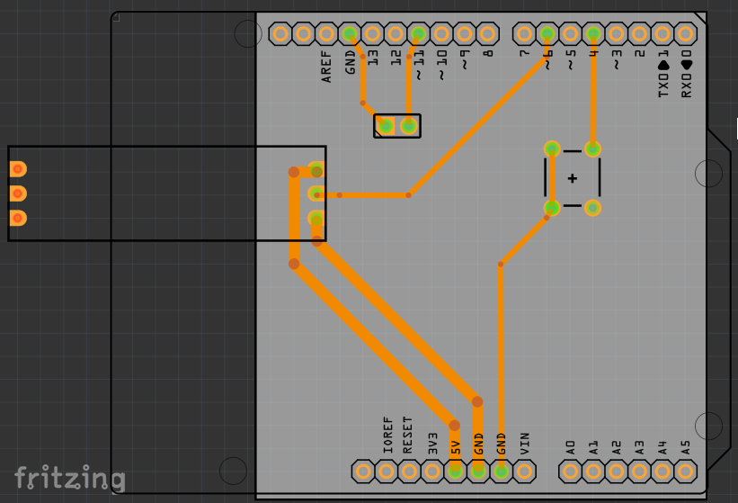

# フラッシュザウルスもどき

- Arduino UnoとLEDテープ、パッシブブザーを用いた、フラッシュザウルス風ゲーム。
- 「フラッシュザウルス」については「[東京フレンドパークのアトラクション一覧](https://ja.wikipedia.org/wiki/%E6%9D%B1%E4%BA%AC%E3%83%95%E3%83%AC%E3%83%B3%E3%83%89%E3%83%91%E3%83%BC%E3%82%AF%E3%81%AE%E3%82%A2%E3%83%88%E3%83%A9%E3%82%AF%E3%82%B7%E3%83%A7%E3%83%B3%E4%B8%80%E8%A6%A7)」を参考に。

## ゲーム概要

以下は、本物のフラッシュザウルスのルールでなく、本スケッチでのルール。
+ ボタンを押すとゲーム開始。
+ 1ゲーム10ラウンド制。
+ arduino本体から離れた位置からLEDドットが近づいてくるので黄色LED上でボタンを押す。
+ 黄色LED上でボタンを押すことができればそのラウンドは成功。黄色LEDを外れると失敗。
+ arduino寄りの10LEDでポイントを表示する。成功は緑、失敗は赤。
+ ラウンド開始後、LEDドットはランダムウエイト後にランダム位置からランダム速度で近づく。
+ 黄色LEDはラウンドが進むと短くなる。また配置はランダムにずれる。
+ ボタンを押しながらarduino本体の電源を入れると輝度調整モードに入る。希望輝度でボタンを離す。

## 参考

- https://github.com/adafruit/Adafruit_NeoPixel
  - ライブラリマネージャからインストールしておく。
- https://github.com/lalaso2000/Music/
  - 本ソースに含む。曲データは適宜差し替えた。

## 利用パーツ

リンク先は作例で使用したもの。

+ Arduino UNO Rev.3 で動作確認
  - due は IO電圧が3.3Vだが、WS2812B の操作は可能、ただし、tone()が利用できないため、本スケッチはそのまま利用できない。
    - due 用 tone() の例：https://forum.arduino.cc/t/arduino-due-and-tone/133302/2
  - その他の arduino でも基本的には動作すると思われる。
+ Arduino と LEDテープ・スイッチ・ブザー接続用のユニバーサル基板
  - [スイッチ・サイエンス：Arduino用バニラシールド基板](https://www.switch-science.com/products/991)
    - 別途ピンヘッダ、もしくはピンソケットが必要。
    - （説明）[スイッチ・サイエンス：バニラシールド](https://trac.switch-science.com/wiki/VanillaShield)
  - arduinoのピンソケットはシールド基板の逆接続防止に一部間隔がずれているので、一般的なユニバーサル基板を使う場合はピンヘッダを曲げてズレに対応させる（おすすめはしない）。
+ LEDテープ 144個を想定。amazonで2,000円程度。
  - Adafruit_NeoPixelで利用できるもの。以下で動作確認した。
  - [amazon：ALITOVE WS2812B LEDテープ1m 144連 NeoPixel RGB TAPE LED 5050 SMD LEDテープライトピクセル 防水 黒いベース 5V DC](https://www.amazon.co.jp/dp/B01MYT6JH9/)
    - 2017年10月購入
  - [amazon：BTF-LIGHTING WS2812B LEDテープライト 5050 SMD RGBIC 合金ワイヤー 1m 144LEDs](https://www.amazon.co.jp/dp/B088JTMSYY/)
    - 2024年7月購入
  - WS2812B の詳細はこちらから
    - [秋月電子：マイコン内蔵RGBLED WS2812B](https://akizukidenshi.com/catalog/g/g107915/)
+ パッシブブザー
  - arduino tone()で利用できるもの。
  - 電源に接続するだけで音が出るものはアクティブブザー。tone()で利用できない。
  - [amazon：KKHMF 20個パッシブブザー 電磁 ユニバーサル インピーダンス 16R 12*8.5mm ピッチ 6.5mm](https://www.amazon.co.jp/gp/product/B08LB2GYD1/)
+ 押ボタンスイッチ
  - 押している間だけONになるモーメンタリなものを使う。
  - [モノタロウ：押しボタンスイッチ AR22シリーズ 突形(Φ24) 非照光式 取付穴径22.3/25.5mm モメンタリ 1a](https://www.monotaro.com/p/3492/4644/)
    - 取付穴寸法：直径22mm。ストロークが長いと不評だった。
  - [千石通商：三和電子　OBSF-24](https://www.sengoku.co.jp/mod/sgk_cart/detail.php?code=55AU-8ALR)
    - 取付穴寸法：直径24mm。
+ ケース
  - ダイソーの食品用容器

## 注意
+ LEDをあまり明るくすると電源がもたないかも。
  -  [秋月電子：マイコン内蔵RGBLED WS2812B](https://akizukidenshi.com/catalog/g/g107915/)の[データシート](https://akizukidenshi.com/goodsaffix/WS2812B_20200225.pdff)だと動作電流が「12mA」とあり、144個全てが12mA使うと「1.728A」に達する。

## 回路図

## ブレッドボード配線例

## シールド基板配線例

- ケースに入れる場合は適宜コネクタ等利用する。

----

2024-07-18 ohguma 本ドキュメント追記、画像更新
2024-07-07 ohguma 低得点時の補正、ハイスコア表示、等対応
2024-07-06 ohguma 初版